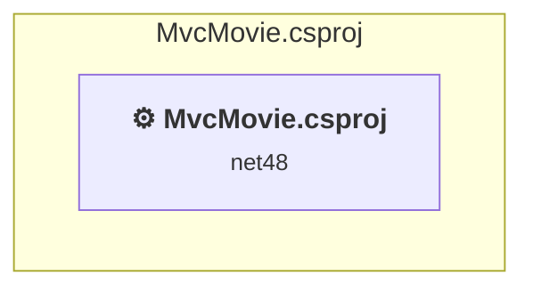

# Projects and dependencies analysis

This document provides a comprehensive overview of the projects and their dependencies in the context of upgrading to .NETCoreApp,Version=v10.0.

## Table of Contents

- [Executive Summary](#executive-Summary)
  - [Highlevel Metrics](#highlevel-metrics)
  - [Projects Compatibility](#projects-compatibility)
  - [Package Compatibility](#package-compatibility)
  - [API Compatibility](#api-compatibility)
  - [Binding Redirect Configuration](#binding-redirect-configuration)
- [Aggregate NuGet packages details](#aggregate-nuget-packages-details)
- [Top API Migration Challenges](#top-api-migration-challenges)
  - [Technologies and Features](#technologies-and-features)
  - [Most Frequent API Issues](#most-frequent-api-issues)
- [Projects Relationship Graph](#projects-relationship-graph)
- [Project Details](#project-details)

  - [MvcMovie\MvcMovie.csproj](#mvcmoviemvcmoviecsproj)

## Executive Summary

### Highlevel Metrics

| Metric | Count | Status |
| :--- | :---: | :--- |
| Total Projects | 1 | All require upgrade |
| Total NuGet Packages | 35 | 22 need upgrade |
| Total Code Files | 57 |  |
| Total Code Files with Incidents | 30 |  |
| Total Lines of Code | 3022 |  |
| Total Number of Issues | 797 |  |
| Estimated LOC to modify | 715+ | at least 23,7% of codebase |

### Projects Compatibility

| Project | Target Framework | Difficulty | Package Issues | API Issues | Binding Issues | Est. LOC Impact | Description |
| :--- | :---: | :---: | :---: | :---: | :---: | :---: | :--- |
| [MvcMovie\MvcMovie.csproj](#mvcmoviemvcmoviecsproj) | net48 | 🔴 High | 40 | 715 | 16 | 715+ | Wap, Sdk Style = False |

### Package Compatibility

| Status | Count | Percentage |
| :--- | :---: | :---: |
| ✅ Compatible | 13 | 37,1% |
| ⚠️ Incompatible | 20 | 57,1% |
| 🔄 Upgrade Recommended | 2 | 5,7% |
| ***Total NuGet Packages*** | ***35*** | ***100%*** |

### API Compatibility

| Category | Count | Impact |
| :--- | :---: | :--- |
| 🔴 Binary Incompatible | 704 | High - Require code changes |
| 🟡 Source Incompatible | 11 | Medium - Needs re-compilation and potential conflicting API error fixing |
| 🔵 Behavioral change | 0 | Low - Behavioral changes that may require testing at runtime |
| ✅ Compatible | 1193 |  |
| ***Total APIs Analyzed*** | ***1908*** |  |

### Binding Redirect Configuration

| Severity | Count | Description |
| :--- | :---: | :--- |
| 🔴Mandatory | 3 | Must be fixed to avoid runtime failures |
| 🟡Potential | 13 | May cause issues in certain scenarios |
| ***Total Binding Issues*** | ***16*** | ***Across 1 project(s)*** |

## Aggregate NuGet packages details

| Package | Current Version | Suggested Version | Projects | Description |
| :--- | :---: | :---: | :--- | :--- |
| Antlr | 3.4.1.9004 |  | [MvcMovie.csproj](#mvcmoviemvcmoviecsproj) | Needs to be replaced with Replace with new package Antlr4=4.6.6 |
| bootstrap | 3.4.1 |  | [MvcMovie.csproj](#mvcmoviemvcmoviecsproj) | ✅Compatible |
| cldrjs | 0.4.1 |  | [MvcMovie.csproj](#mvcmoviemvcmoviecsproj) | ✅Compatible |
| EntityFramework | 6.1.3 | 6.5.2 | [MvcMovie.csproj](#mvcmoviemvcmoviecsproj) | NuGet package upgrade is recommended |
| jQuery | 3.5.0 |  | [MvcMovie.csproj](#mvcmoviemvcmoviecsproj) | ⚠️NuGet package is deprecated |
| jQuery.Validation | 1.19.3 |  | [MvcMovie.csproj](#mvcmoviemvcmoviecsproj) | ✅Compatible |
| jQuery.Validation.Globalize | 1.1.0 |  | [MvcMovie.csproj](#mvcmoviemvcmoviecsproj) | ✅Compatible |
| jquery-globalize | 1.0.0 |  | [MvcMovie.csproj](#mvcmoviemvcmoviecsproj) | ✅Compatible |
| Microsoft.ApplicationInsights | 2.2.0 |  | [MvcMovie.csproj](#mvcmoviemvcmoviecsproj) | ⚠️NuGet package is deprecated |
| Microsoft.ApplicationInsights.Agent.Intercept | 2.0.6 |  | [MvcMovie.csproj](#mvcmoviemvcmoviecsproj) | ⚠️NuGet package is incompatible |
| Microsoft.ApplicationInsights.DependencyCollector | 2.2.0 | 2.23.0 | [MvcMovie.csproj](#mvcmoviemvcmoviecsproj) | ⚠️NuGet package is incompatible |
| Microsoft.ApplicationInsights.PerfCounterCollector | 2.2.0 | 2.23.0 | [MvcMovie.csproj](#mvcmoviemvcmoviecsproj) | ⚠️NuGet package is incompatible |
| Microsoft.AspNet.Identity.Core | 2.2.4 |  | [MvcMovie.csproj](#mvcmoviemvcmoviecsproj) | ⚠️NuGet package is incompatible |
| Microsoft.AspNet.Identity.EntityFramework | 2.2.1 |  | [MvcMovie.csproj](#mvcmoviemvcmoviecsproj) | ⚠️NuGet package is incompatible |
| Microsoft.AspNet.Identity.Owin | 2.2.4 |  | [MvcMovie.csproj](#mvcmoviemvcmoviecsproj) | ⚠️NuGet package is incompatible |
| Microsoft.AspNet.Mvc | 5.2.3 |  | [MvcMovie.csproj](#mvcmoviemvcmoviecsproj) | NuGet package functionality is included with framework reference |
| Microsoft.AspNet.Razor | 3.2.3 |  | [MvcMovie.csproj](#mvcmoviemvcmoviecsproj) | NuGet package functionality is included with framework reference |
| Microsoft.AspNet.Web.Optimization | 1.1.3 |  | [MvcMovie.csproj](#mvcmoviemvcmoviecsproj) | ⚠️NuGet package is incompatible |
| Microsoft.AspNet.WebPages | 3.2.3 |  | [MvcMovie.csproj](#mvcmoviemvcmoviecsproj) | NuGet package functionality is included with framework reference |
| Microsoft.jQuery.Unobtrusive.Validation | 3.2.3 |  | [MvcMovie.csproj](#mvcmoviemvcmoviecsproj) | ⚠️NuGet package is deprecated |
| Microsoft.Owin | 4.2.2 |  | [MvcMovie.csproj](#mvcmoviemvcmoviecsproj) | ⚠️NuGet package is incompatible |
| Microsoft.Owin.Host.SystemWeb | 3.0.1 |  | [MvcMovie.csproj](#mvcmoviemvcmoviecsproj) | ⚠️NuGet package is incompatible |
| Microsoft.Owin.Security | 3.0.1 |  | [MvcMovie.csproj](#mvcmoviemvcmoviecsproj) | ⚠️NuGet package is incompatible |
| Microsoft.Owin.Security.Cookies | 3.0.1 |  | [MvcMovie.csproj](#mvcmoviemvcmoviecsproj) | ⚠️Replace with Microsoft.AspNetCore.Authentication.Cookies: Use AddAuthentication().AddCookie() in Startup; adjust cookie options |
| Microsoft.Owin.Security.Facebook | 3.0.1 |  | [MvcMovie.csproj](#mvcmoviemvcmoviecsproj) | ⚠️NuGet package is incompatible |
| Microsoft.Owin.Security.Google | 3.0.1 |  | [MvcMovie.csproj](#mvcmoviemvcmoviecsproj) | ⚠️NuGet package is incompatible |
| Microsoft.Owin.Security.MicrosoftAccount | 3.0.1 |  | [MvcMovie.csproj](#mvcmoviemvcmoviecsproj) | ⚠️NuGet package is incompatible |
| Microsoft.Owin.Security.OAuth | 3.0.1 |  | [MvcMovie.csproj](#mvcmoviemvcmoviecsproj) | ⚠️Replace with Microsoft.AspNetCore.Authentication.JwtBearer: Use JWT Bearer for token validation; adopt IdentityServer or Azure AD for issuing tokens |
| Microsoft.Owin.Security.Twitter | 3.0.1 |  | [MvcMovie.csproj](#mvcmoviemvcmoviecsproj) | ⚠️NuGet package is incompatible |
| Microsoft.Web.Infrastructure | 1.0.0.0 |  | [MvcMovie.csproj](#mvcmoviemvcmoviecsproj) | NuGet package functionality is included with framework reference |
| Modernizr | 2.6.2 |  | [MvcMovie.csproj](#mvcmoviemvcmoviecsproj) | ✅Compatible |
| Newtonsoft.Json | 13.0.1 | 13.0.4 | [MvcMovie.csproj](#mvcmoviemvcmoviecsproj) | NuGet package upgrade is recommended |
| Owin | 1.0 |  | [MvcMovie.csproj](#mvcmoviemvcmoviecsproj) | ⚠️NuGet package is incompatible |
| Respond | 1.2.0 |  | [MvcMovie.csproj](#mvcmoviemvcmoviecsproj) | ✅Compatible |
| WebGrease | 1.5.2 |  | [MvcMovie.csproj](#mvcmoviemvcmoviecsproj) | ✅Compatible |

## Top API Migration Challenges

### Technologies and Features

| Technology | Issues | Percentage | Migration Path |
| :--- | :---: | :---: | :--- |
| ASP.NET Framework (System.Web) | 537 | 75,1% | Legacy ASP.NET Framework APIs for web applications (System.Web.*) that don't exist in ASP.NET Core due to architectural differences. ASP.NET Core represents a complete redesign of the web framework. Migrate to ASP.NET Core equivalents or consider System.Web.Adapters package for compatibility. |

### Most Frequent API Issues

| API | Count | Percentage | Category |
| :--- | :---: | :---: | :--- |
| T:System.Web.Mvc.ViewResult | 57 | 8,0% | Binary Incompatible |
| T:System.Web.Mvc.ActionResult | 31 | 4,3% | Binary Incompatible |
| T:System.Web.Mvc.RedirectToRouteResult | 25 | 3,5% | Binary Incompatible |
| M:System.Web.Mvc.Controller.View(System.Object) | 25 | 3,5% | Binary Incompatible |
| P:System.Web.Mvc.Controller.User | 25 | 3,5% | Binary Incompatible |
| T:Microsoft.AspNet.Identity.IdentityExtensions | 24 | 3,4% | Binary Incompatible |
| M:Microsoft.AspNet.Identity.IdentityExtensions.GetUserId(System.Security.Principal.IIdentity) | 24 | 3,4% | Binary Incompatible |
| M:System.Web.Mvc.HttpPostAttribute.#ctor | 22 | 3,1% | Binary Incompatible |
| T:System.Web.Mvc.HttpPostAttribute | 22 | 3,1% | Binary Incompatible |
| T:Microsoft.AspNet.Identity.Owin.SignInStatus | 22 | 3,1% | Binary Incompatible |
| M:System.Web.Mvc.ValidateAntiForgeryTokenAttribute.#ctor | 21 | 2,9% | Binary Incompatible |
| T:System.Web.Mvc.ValidateAntiForgeryTokenAttribute | 21 | 2,9% | Binary Incompatible |
| M:System.Web.Mvc.AllowAnonymousAttribute.#ctor | 19 | 2,7% | Binary Incompatible |
| T:System.Web.Mvc.AllowAnonymousAttribute | 19 | 2,7% | Binary Incompatible |
| M:System.Web.Mvc.Controller.View | 18 | 2,5% | Binary Incompatible |
| T:System.Web.Mvc.ModelStateDictionary | 18 | 2,5% | Binary Incompatible |
| P:System.Web.Mvc.Controller.ModelState | 18 | 2,5% | Binary Incompatible |
| P:System.Web.Mvc.ModelStateDictionary.IsValid | 13 | 1,8% | Binary Incompatible |
| M:System.Web.Mvc.Controller.View(System.String) | 13 | 1,8% | Binary Incompatible |
| P:System.Web.Mvc.ControllerBase.ViewBag | 12 | 1,7% | Binary Incompatible |
| M:System.Web.Mvc.Controller.RedirectToAction(System.String,System.Object) | 12 | 1,7% | Binary Incompatible |
| M:System.Web.Mvc.Controller.#ctor | 11 | 1,5% | Binary Incompatible |
| P:Microsoft.AspNet.Identity.IdentityResult.Succeeded | 11 | 1,5% | Binary Incompatible |
| M:System.Web.Mvc.Controller.RedirectToAction(System.String,System.String) | 8 | 1,1% | Binary Incompatible |
| T:Microsoft.AspNet.Identity.DefaultAuthenticationTypes | 6 | 0,8% | Binary Incompatible |
| T:System.Web.HttpContextBase | 6 | 0,8% | Source Incompatible |
| P:System.Web.Mvc.Controller.HttpContext | 6 | 0,8% | Binary Incompatible |
| T:Microsoft.AspNet.Identity.Owin.OwinContextExtensions | 6 | 0,8% | Binary Incompatible |
| T:Microsoft.AspNet.Identity.IIdentityMessageService | 6 | 0,8% | Binary Incompatible |
| T:Owin.AppBuilderExtensions | 6 | 0,8% | Binary Incompatible |
| T:System.Web.Mvc.Controller | 5 | 0,7% | Binary Incompatible |
| M:System.Web.Mvc.Controller.RedirectToAction(System.String) | 5 | 0,7% | Binary Incompatible |
| M:System.Web.Mvc.ModelStateDictionary.AddModelError(System.String,System.String) | 5 | 0,7% | Binary Incompatible |
| T:Microsoft.Owin.Security.AuthenticationManagerExtensions | 5 | 0,7% | Binary Incompatible |
| T:System.Web.Optimization.Bundle | 5 | 0,7% | Binary Incompatible |
| M:System.Web.Optimization.BundleCollection.Add(System.Web.Optimization.Bundle) | 5 | 0,7% | Binary Incompatible |
| T:Microsoft.AspNet.Identity.UserLoginInfo | 4 | 0,6% | Binary Incompatible |
| T:System.Web.Optimization.ScriptBundle | 4 | 0,6% | Binary Incompatible |
| M:System.Web.Optimization.ScriptBundle.#ctor(System.String) | 4 | 0,6% | Binary Incompatible |
| F:Microsoft.AspNet.Identity.DefaultAuthenticationTypes.ApplicationCookie | 3 | 0,4% | Binary Incompatible |
| M:System.Web.Mvc.Controller.Dispose(System.Boolean) | 3 | 0,4% | Binary Incompatible |
| T:System.Web.Mvc.HttpNotFoundResult | 3 | 0,4% | Binary Incompatible |
| M:System.Web.Mvc.Controller.HttpNotFound | 3 | 0,4% | Binary Incompatible |
| T:System.Web.Mvc.HttpStatusCodeResult | 3 | 0,4% | Binary Incompatible |
| M:System.Web.Mvc.HttpStatusCodeResult.#ctor(System.Net.HttpStatusCode) | 3 | 0,4% | Binary Incompatible |
| T:System.Web.Mvc.UrlHelper | 3 | 0,4% | Binary Incompatible |
| P:System.Web.Mvc.Controller.Url | 3 | 0,4% | Binary Incompatible |
| P:Microsoft.AspNet.Identity.Owin.ExternalLoginInfo.Login | 3 | 0,4% | Binary Incompatible |
| F:Microsoft.AspNet.Identity.Owin.SignInStatus.Failure | 3 | 0,4% | Binary Incompatible |
| F:Microsoft.AspNet.Identity.Owin.SignInStatus.LockedOut | 3 | 0,4% | Binary Incompatible |

## Projects Relationship Graph

Legend:
📦 SDK-style project
⚙️ Classic project

## Project Details

### MvcMovie\MvcMovie.csproj

#### Project Info

- **Current Target Framework:** net48
- **Proposed Target Framework:** net10.0
- **SDK-style**: False
- **Project Kind:** Wap
- **Dependencies**: 0
- **Dependants**: 0
- **Number of Files**: 99
- **Number of Files with Incidents**: 30
- **Lines of Code**: 3022
- **Estimated LOC to modify**: 715+ (at least 23,7% of the project)

#### Dependency Graph

Legend:
📦 SDK-style project
⚙️ Classic project

### API Compatibility

| Category | Count | Impact |
| :--- | :---: | :--- |
| 🔴 Binary Incompatible | 704 | High - Require code changes |
| 🟡 Source Incompatible | 11 | Medium - Needs re-compilation and potential conflicting API error fixing |
| 🔵 Behavioral change | 0 | Low - Behavioral changes that may require testing at runtime |
| ✅ Compatible | 1193 |  |
| ***Total APIs Analyzed*** | ***1908*** |  |

#### Binding Redirect Configuration

| Rule | Severity | Details | Recommendation |
| :--- | :---: | :--- | :--- |
| Missing binding redirect for referenced assembly | 🟡Potential | Manual redirects exist but none covers Microsoft.AspNet.Identity.Core (referenced v2.0.0.0, package v2.2.4) | Add a binding redirect for the missing assembly. |
| Missing binding redirect for referenced assembly | 🟡Potential | Manual redirects exist but none covers EntityFramework (referenced v6.0.0.0, package v6.1.3) | Add a binding redirect for the missing assembly. |
| Missing binding redirect for referenced assembly | 🟡Potential | Manual redirects exist but none covers Microsoft.AspNet.Identity.Owin (referenced v2.0.0.0, package v2.2.4) | Add a binding redirect for the missing assembly. |
| Missing binding redirect for referenced assembly | 🟡Potential | Manual redirects exist but none covers Microsoft.AspNet.Identity.EntityFramework (referenced v2.0.0.0, package v2.2.1) | Add a binding redirect for the missing assembly. |
| Missing binding redirect for referenced assembly | 🟡Potential | Manual redirects exist but none covers Owin (referenced v1.0.0.0, package v1.0) | Add a binding redirect for the missing assembly. |
| Missing binding redirect for referenced assembly | 🟡Potential | Manual redirects exist but none covers Microsoft.Owin.Host.SystemWeb (referenced v3.0.1.0, package v3.0.1) | Add a binding redirect for the missing assembly. |
| Missing binding redirect for referenced assembly | 🟡Potential | Manual redirects exist but none covers Microsoft.Owin.Security.Facebook (referenced v3.0.1.0, package v3.0.1) | Add a binding redirect for the missing assembly. |
| Missing binding redirect for referenced assembly | 🟡Potential | Manual redirects exist but none covers Microsoft.Owin.Security.Google (referenced v3.0.1.0, package v3.0.1) | Add a binding redirect for the missing assembly. |
| Missing binding redirect for referenced assembly | 🟡Potential | Manual redirects exist but none covers Microsoft.Owin.Security.Twitter (referenced v3.0.1.0, package v3.0.1) | Add a binding redirect for the missing assembly. |
| Missing binding redirect for referenced assembly | 🟡Potential | Manual redirects exist but none covers Microsoft.Owin.Security.MicrosoftAccount (referenced v3.0.1.0, package v3.0.1) | Add a binding redirect for the missing assembly. |
| Missing binding redirect for referenced assembly | 🟡Potential | Manual redirects exist but none covers Microsoft.ApplicationInsights (referenced v2.2.0.0, package v2.2.0) | Add a binding redirect for the missing assembly. |
| Manual redirect conflicts with auto-generated version | 🔴Mandatory | Manual redirect for Microsoft.Owin targets 3.0.1.0 but auto-generation would target 4.2.2 (MSB3836 conflict) | Remove the conflicting manual binding redirect or disable auto-generation. |
| Manual redirect conflicts with auto-generated version | 🔴Mandatory | Manual redirect for Newtonsoft.Json targets 13.0.0.0 but auto-generation would target 13.0.1 (MSB3836 conflict) | Remove the conflicting manual binding redirect or disable auto-generation. |
| Binding redirect forces version downgrade | 🟡Potential | Binding redirect for Microsoft.Owin targets 3.0.1.0 but reference requires 4.2.2.0 | Update the binding redirect newVersion to match the version provided by the NuGet package. |
| Assembly version mismatch with insufficient redirect coverage | 🔴Mandatory | Redirect for Microsoft.Owin has oldVersion="0.0.0.0-3.0.1.0" which does not cover referenced version 4.2.2.0 | Add or update binding redirect with oldVersion="0.0.0.0-{TargetVersion}" newVersion="{TargetVersion}". |
| Binding redirect forces version downgrade | 🟡Potential | Binding redirect for Newtonsoft.Json targets 13.0.0.0 but package provides 13.0.1 | Update the binding redirect newVersion to match the version provided by the NuGet package. |

#### Project Technologies and Features

| Technology | Issues | Percentage | Migration Path |
| :--- | :---: | :---: | :--- |
| ASP.NET Framework (System.Web) | 537 | 75,1% | Legacy ASP.NET Framework APIs for web applications (System.Web.*) that don't exist in ASP.NET Core due to architectural differences. ASP.NET Core represents a complete redesign of the web framework. Migrate to ASP.NET Core equivalents or consider System.Web.Adapters package for compatibility. |

